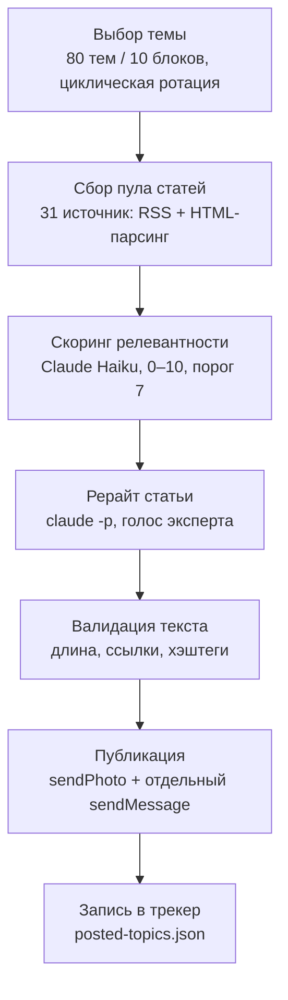

<div align="center">

# Автопостер для Telegram-канала психолога

Автономный контент-бот: 2 раза в день без участия человека парсит статьи по психологии отношений,
переписывает их голосом эксперта через Claude и публикует в Telegram-канал.

**Канал:** [t.me/domgdeslushat](https://t.me/domgdeslushat)


</div>

---

## Что делает

Бот не публикует случайные найденные статьи. Он идёт от контент-плана: сначала выбирает тему,
затем ищет под неё материал, а не наоборот.



Если для темы не нашлось подходящей статьи (score < 7) — бот пробует следующую тему по плану
(до 5 попыток за прогон), а не публикует что попало.

## Что здесь интересного инженерно

Это боевой бот: публикует без ревью человеком дважды в день. Ниже — решения, которые
понадобились, чтобы это было безопасно и не превратилось в мусорку из дублей.

**4-уровневая дедупликация.** Дубль в канале — репутационный ущерб, поэтому проверка не
одна, а четыре, разного рода:
- L1 — точное совпадение URL (с нормализацией: убираются `utm_*`/`fbclid`/`gclid`, трейлинг-слэш, регистр);
- L2 — Jaccard-коэффициент по словам заголовков, порог `0.35`;
- L3 — «отпечаток» ключевых сущностей (слова ≥6 символов) статьи, сравнение через containment
  (пересечение / длина меньшего множества), порог `0.6` — специально не Jaccard, потому что
  старые записи в трекере хранят усечённый отпечаток, и union-based Jaccard на длинных статьях
  для них никогда бы не сработал;
- L4 — семантическая проверка заголовка через Claude Haiku (сравнение с последними 40
  опубликованными заголовками) и отдельно MinHash уже рерайтнутого текста (64 хэш-функции,
  4-словные шинглы, порог `0.30`) — ловит повтор смысла даже при другой формулировке.

**Topic-first вместо article-first.** Изначально пайплайн шёл от статьи: бралась случайная
статья и подбиралась тема. Это привело к реальному багу: пост «Роль границ в семье» вышел с
картинкой из статьи-подборки анекдотов AdMe, потому что сопоставление статьи с темой сработало
на слабом семантическом пересечении. Пайплайн перевернули: тема выбирается первой по плану,
под неё собирается пул кандидатов, и только затем Haiku скорит релевантность каждой статьи теме.

**Защита от prompt injection.** Текст статей — контент с чужих сайтов, и он попадает в промпт
Claude без ревью человека перед публикацией результата. Весь внешний контент оборачивается в
`<untrusted_article_content>...</untrusted_article_content>` с явной инструкцией не выполнять
команды, которые могут встретиться внутри — это касается промптов скоринга, рерайта и
семантической проверки дублей.

**SSRF-защита.** `_is_safe_url()` отклоняет не-http(s) схемы, `.local`/`.internal` домены и
резолвит хост, чтобы отсечь private/loopback/reserved/link-local IP. Но проверки самого URL
недостаточно: враждебный сервер может вернуть 302 на `169.254.169.254` уже после того, как
первый URL прошёл валидацию. Поэтому `_safe_request()` никогда не передаёт `requests`
`allow_redirects=True` — редиректы обрабатываются вручную, и каждый следующий хоп (включая
относительные `Location`) заново проверяется через `_is_safe_url()`, максимум 3 хопа.
Исключение — загрузка самих RSS-фидов: их URL берутся из `sources.json`, то есть из доверенного
конфига, а не из внешнего контента, поэтому там достаточно таймаутов.

**Редакция секретов в логах.** `requests` вшивает полный URL запроса — вместе с токеном бота
или access_token — в текст сетевого исключения. Если такое исключение просто залогировать,
токен утечёт в файл. `publishers/log_safety.py` вешает `logging.Filter` на root-логгер и на
каждый его хендлер (записи от `requests`/`urllib3` всплывают в хендлеры мимо фильтров
логгера-предка), плюс есть `redact_text()`/`describe_exception()` для явной редакции в
except-блоках самих publisher-ов.

**Идемпотентность и защита данных.** Неблокирующий `flock` на `posted-topics.lock` берётся
первым действием в `main()` — если процесс уже запущен (наложение cron-прогонов — штатная
ситуация), второй экземпляр выходит с кодом 0, а не падает. Запись трекера — атомарная
(`tmp`-файл + `os.replace`) с бэкапом предыдущей версии в `.bak`. Если `posted-topics.json`
повреждён — процесс останавливается с `critical`+`exit(1)`, а не тихо продолжает с пустым
списком: иначе первая же публикация перезаписала бы всю историю дедупликации одной записью.

**Валидация поста перед публикацией.** `_validate_rewritten_post()` — последний рубеж перед
отправкой в Telegram, независимый от того, подчинилась ли модель инструкциям внутри
`<untrusted_article_content>`: длина 200–4096 символов, запрет http-ссылок и markdown-ссылок
в тексте, обязательное наличие хэштегов. Проверено прогоном по 138 реальным постам канала —
133 проходят, отказы — на служебных сообщениях Telegram и трёх первых постах канала без хэштегов.

**Отказоустойчивость.** `run_with_retry.sh` определяет успех прогона не по exit-коду (
`main()` в ряде путей — пустой пул кандидатов, ни одна статья не подошла теме, Telegram не
принял пост — просто `return`, без `sys.exit()`, то есть код 0 без публикации), а по наличию
маркерной строки `INFO Опубликовано: ` в выводе — до 3 попыток с паузой 60с. Telegram 429
обрабатывается ожиданием `retry_after` из ответа API. RSS-запросы идут через `requests` с
таймаутом `(10, 20)` — раньше `feedparser.parse(url)` без таймаута мог подвесить процесс навсегда.

**Мульти-платформенность.** Telegram обязателен, Facebook и Instagram (Graph API v21.0) —
best-effort через общий интерфейс `Publisher`: если токены не заданы, канал просто
пропускается (`is_configured() == False`), без ошибок. Запись в `posted-topics.json`
(и вся дедупликация) обновляется только при успехе именно Telegram — падение FB/IG не блокирует
дедуп и не портит трекер.

**Циклическая ротация контента.** Тематический план — 80 тем в 10 блоках. После публикации
всех 80 начинается цикл 2 (`compute_current_cycle()`), и в промпт рерайта для тем с cycle ≥ 2
передаются выдержки (первые 400 символов) прошлых постов по этой же теме с явной инструкцией
не повторять тезисы и формулировки, а взять тему с другого угла.

## Стек

- **Python 3.10+**
- `requests` — HTTP (RSS-фид по URL, HTML-страницы, Telegram/Graph API)
- `beautifulsoup4` — парсинг HTML статей
- `feedparser` — разбор RSS
- `python-dotenv` — загрузка `.env`
- **Claude Code CLI** (`claude -p`) — скоринг релевантности (Haiku), рерайт (Sonnet), семантическая проверка дублей (Haiku)
- **cron** — расписание публикаций

Никаких тяжёлых фреймворков — по сути это скрипт с чёткой конвейерной архитектурой поверх
стандартной библиотеки и трёх внешних пакетов (см. `requirements.txt`).

## Структура проекта

```
post_bot.py            # основной пайплайн: выбор темы → сбор статей → скоринг →
                       #   рерайт → валидация → публикация → трекер
publishers/
  base.py              # контракт Publisher + PublishResult
  telegram.py          # sendPhoto + sendMessage, retry на 429/5xx, HTML→plain fallback
  facebook.py          # публикация в Facebook Page через Graph API
  instagram.py         # публикация в Instagram Business Account через Graph API
  log_safety.py        # редакция токенов в логах (root-логгер + хендлеры)
run_with_retry.sh      # cron-обёртка: до 3 попыток, успех — по маркеру в логе, а не exit-коду
setup.sh               # venv, зависимости, права на .env/config.json/logs
requirements.txt       # requests, beautifulsoup4, feedparser, python-dotenv
sources.json           # список источников (RSS/HTML, селекторы, блэклисты путей)
config.example.json    # шаблон конфига (без секретов)
.env.example           # шаблон переменных окружения (без секретов)
test_publishers.py     # smoke-test конфигурации publisher-ов, без живых запросов к API
CLAUDE.md              # контент-план (80 тем/10 блоков) и правила для агента
JOURNAL.md             # инженерный журнал: ключевые решения, найденные и починенные баги
```

## Установка и запуск

```bash
git clone https://github.com/jw-git-hub/psy-aleksander-tg-auto-posts-bot.git
cd psy-aleksander-tg-auto-posts-bot

chmod +x setup.sh && ./setup.sh    # venv, зависимости, права на .env/config.json/logs

cp .env.example .env
# заполнить TELEGRAM_BOT_TOKEN и TELEGRAM_CHAT_ID (обязательно),
# при желании — FACEBOOK_*/INSTAGRAM_* (опционально)
chmod 600 .env

# проверка конфигурации без живых запросов к API:
./venv/bin/python3 test_publishers.py

# прогон без реальной публикации (симулирует, но не шлёт в Telegram/FB/IG):
DRY_RUN=1 ./venv/bin/python3 post_bot.py

# реальный тестовый прогон (опубликует один пост):
./venv/bin/python3 post_bot.py
```

Расписание (сервер в UTC, время публикации — 10:00 и 18:00 по Бангкоку, UTC+7):

```cron
0 3 * * *  /path/to/project/run_with_retry.sh >> /path/to/project/logs/cron.log 2>&1
0 11 * * * /path/to/project/run_with_retry.sh >> /path/to/project/logs/cron.log 2>&1
```

`claude` должен быть доступен в `PATH` — бот проверяет это при старте и завершается с ошибкой,
если CLI не найден.

## Конфигурация

Секреты — только через `.env` (приоритет) или `config.json`. Пример без значений — в
`.env.example` и `config.example.json`.

### Переменные окружения (`.env`)

| Переменная | Обязательна | Назначение |
|---|---|---|
| `TELEGRAM_BOT_TOKEN` | да | Токен бота от @BotFather |
| `TELEGRAM_CHAT_ID` | да | ID или `@username` канала для публикации |
| `FACEBOOK_PAGE_ID` | нет | ID страницы Facebook (Graph API) |
| `FACEBOOK_PAGE_ACCESS_TOKEN` | нет | Page Access Token (используется и для Instagram) |
| `INSTAGRAM_BUSINESS_ACCOUNT_ID` | нет | ID Instagram Business Account |

### `config.json`

| Поле | Читается кодом | Назначение |
|---|---|---|
| `telegram_bot_token`, `telegram_chat_id` | да | fallback, если не заданы в `.env` |
| `facebook_page_id`, `facebook_page_access_token` | да | fallback для Facebook/Instagram |
| `instagram_business_account_id` | да | fallback для Instagram |
| `graph_api_version` | да | версия Graph API, по умолчанию `v21.0` |
| `retry_max` | да | число попыток `TelegramPublisher` на 429/5xx |
| `claude_command`, `max_post_length`, `log_file`, `sources_file`, `posted_topics_file`, `schedule_utc` | нет | зарезервированы в шаблоне конфига; пути и лимиты сейчас фиксированы в коде (`logs/post.log`, `sources.json`, `posted-topics.json`, лимит Telegram 4096 символов) |

## Безопасность

- Секреты живут только в `.env`/`config.json`, у обоих права `600` (`setup.sh` выставляет их
  автоматически). В репозитории их нет — оба файла в `.gitignore`.
- `logs/` — права `700`, файлы логов — `600` (см. `setup_logging()`); дополнительно все
  секреты редактируются в логах фильтром (`publishers/log_safety.py`), даже если права на
  каталог почему-то ослаблены.
- `sources.json` публикуется осознанно — это список публичных RSS/сайтов, без секретов.

---

## English

**What it is.** An autonomous Telegram content bot for a family-psychology channel
([t.me/domgdeslushat](https://t.me/domgdeslushat)). Runs twice daily via cron, unattended: picks
a topic from an 80-topic content plan, gathers a candidate pool from ~31 RSS/HTML sources,
scores relevance with Claude Haiku, rewrites the chosen article in the expert's voice via
`claude -p` (Sonnet), validates the result, and publishes to Telegram (`sendPhoto` + separate
`sendMessage`). Facebook/Instagram publishing (Graph API v21.0) is best-effort and optional.

**Stack.** Python 3.10+, `requests`, `beautifulsoup4`, `feedparser`, `python-dotenv`, Claude
Code CLI, cron. No heavy frameworks.

**Engineering highlights.**
- 4-layer deduplication: exact URL → title Jaccard similarity → entity-fingerprint containment
  → semantic check (Claude Haiku) + MinHash on the rewritten text, each layer catching a
  different kind of duplicate.
- Topic-first pipeline (topic chosen before article search) — replaced an article-first design
  after a real bug where a post got a mismatched image from an unrelated source due to weak
  topic-matching.
- Prompt-injection hardening: all scraped article content is wrapped in
  `<untrusted_article_content>` tags with explicit instructions to treat it as data, since
  output is published without human review.
- SSRF protection: manual redirect handling that re-validates every hop (scheme, private/
  loopback/reserved IPs, `.local`/`.internal`) instead of trusting `requests`' built-in redirect
  following.
- Secret redaction in logs: a `logging.Filter` on the root logger and its handlers strips
  bot/API tokens that `requests` embeds in exception messages.
- Crash-safe state: non-blocking file lock for single-instance guarantee, atomic writes
  (`os.replace` + `.bak` backup) for the dedup tracker, hard failure on a corrupted tracker
  file instead of silently resetting history.
- Pre-publish validation (length, no links/markdown, required hashtags), verified against 138
  real published posts.
- Retry wrapper that judges success by a log marker, not exit code, since the script can exit 0
  without publishing anything.

---

### Нужен такой же бот?

Пишу ботов и автоматизацию под заказ — контент-пайплайны, интеграции с Telegram/соцсетями,
рерайт через LLM с продакшн-грейд дедупликацией и безопасностью. Смотрите другие проекты на
[github.com/jw-git-hub](https://github.com/jw-git-hub) или напишите через issues этого репозитория.
